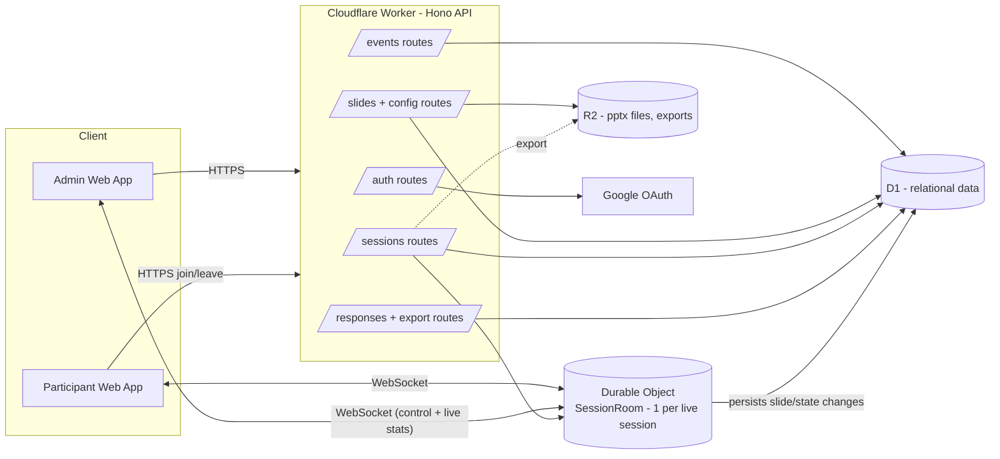
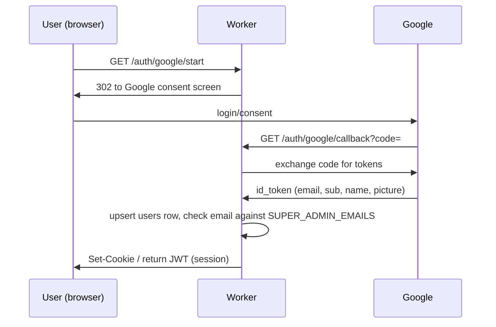

# Live Feedback Platform — Backend Architecture & LLD

**Stack:** Cloudflare Workers (TypeScript, Hono, Zod) · D1 · R2 · Durable Objects (WebSockets) · Cloudflare Static Assets **Status:** Draft v1 — extends the existing prototype toward the full multi-admin, multi-session product

---

## 1. Assumptions & open decisions

You described two conflicting admin models ("super admin grants admin access" vs. "anyone can become admin"). I've picked a concrete default so the schema and APIs aren't ambiguous — flag if you want it changed:


| Area                                   | Assumption made                                                                                                                                                                                                   | Why                                                                                                                  |
| -------------------------------------- | ----------------------------------------------------------------------------------------------------------------------------------------------------------------------------------------------------------------- | -------------------------------------------------------------------------------------------------------------------- |
| Who can create an Event                | Any authenticated Google user. Creating an event makes you its **Owner** (an admin role scoped to that event).                                                                                                    | Matches "let's just say everyone are the admins" — no gatekeeping needed for Phase 1, keeps onboarding frictionless. |
| Who can become a co-admin on an event  | The event Owner (or an existing admin) invites another authenticated user by email. Invite is auto-accepted on next login (no accept/reject flow in Phase 1).                                                     | Matches "one admin can invite another." Keeps invite flow trivial to build.                                          |
| Super Admin                            | A hardcoded email allow-list (env var). Super admins are **platform** admins — they can see/moderate/delete any event and promote/demote anyone, but they are *not* required to grant per-event admin access.     | Reconciles both statements: super admin exists for platform control, not as a bottleneck for normal admin creation.  |
| "Event" vs "Presentation" vs "Session" | `Event` = the persistent container (owns the PPT, slide config, admins). `Session` = one live run of that event with its own code, participants, and responses. An Event can have N Sessions (re-runs).           | Matches your "session 2" description exactly.                                                                        |
| PPT → slide content                    | Assumed you already extract per-slide text/notes on upload (per your current build). Slide **images** (visual rendering) are called out separately in §9 since Workers can't run LibreOffice/PowerPoint natively. | Needs your confirmation — see §9.                                                                                    |


If any of these are wrong, tell me and I'll adjust the schema before you hand this to an agent — it's much cheaper to fix now than after migrations exist.

---

## 2. Requirements recap

**Functional**

- Google OAuth login for everyone (admins and, optionally, participants)
- Super admins hardcoded by email; platform-level moderation powers.
- Any user can create an Event, upload a `.pptx`, configure slides, and invite co-admins.
- Per-slide config: summary/notes shown to participants, and an arbitrary ordered set of feedback fields (boolean, single-select, multi-select, rating/NPS, free text, ...).
- Admin starts a Session → gets a short join code → controls "current slide" live.
- Participants join via code, see the current slide + its form, submit responses.
- One Event → many Sessions; each Session's responses are isolated and exportable independently, plus aggregatable across the Event.
- Live participation/response stats for admins.

**Non-functional**

- Real-time slide sync with low latency (Durable Objects + WebSockets — already chosen, good fit).
- D1 read/write limits: D1 is SQLite-per-database, fine for this scale (single-digit-thousands of concurrent participants per session is a realistic ceiling before you'd need sharding).
- R2 for binary/object storage (pptx files, later slide images/exports).
- Idempotent, duplicate-safe response submission (participant refresh / reconnect shouldn't double count).

---

## 3. High-level architecture



**Key architectural decision carried over from your build:** Durable Objects remain the source of truth for *live* session state (current slide, connected sockets, in-memory stats), while D1 remains the source of truth for *durable* state (everything needed to reconstruct a session after a restart or for export). The DO writes through to D1 on every state-changing event — never the other way around.

---

## 4. Domain model (entities)

```
User
 ├── EventAdmin (join: user ↔ event, role)
 └── Session.created_by (FK → User)

Event
 ├── PresentationFile (1:1 active, N historical versions)
 ├── Slide (1:N, ordered)
 │    └── FeedbackField (1:N, ordered) — per-slide form schema
 └── Session (1:N)
       ├── Participant (1:N)
       ├── SessionSlideState (1:1, current pointer — mirrors DO memory)
       └── Response (N:N Participant × FeedbackField, scoped to a Session)

```

Notes:

- `FeedbackField` belongs to a `Slide`, not to a reusable global bank, to keep Phase 1 simple — see Phase 3 in [`plan.md`](http://plan.md) for promoting common fields into a reusable question bank if you want that later.
- `Response` is scoped by `session_id` (not `event_id`) so that re-running an event never mixes data across runs, while `event_id` is still denormalized onto `Response` for fast cross-session aggregation queries.

---

## 5. D1 schema (LLD)

```sql
-- ===== Identity =====
CREATE TABLE users (
  id            TEXT PRIMARY KEY,           -- uuid
  google_sub    TEXT UNIQUE NOT NULL,
  email         TEXT UNIQUE NOT NULL,
  name          TEXT,
  avatar_url    TEXT,
  is_super_admin INTEGER NOT NULL DEFAULT 0, -- computed at login from env allow-list, cached here
  created_at    TEXT NOT NULL DEFAULT (datetime('now')),
  last_login_at TEXT
);

-- ===== Events =====
CREATE TABLE events (
  id            TEXT PRIMARY KEY,
  name          TEXT NOT NULL,
  description   TEXT,
  owner_id      TEXT NOT NULL REFERENCES users(id),
  status        TEXT NOT NULL DEFAULT 'draft',  -- draft | configured | archived
  created_at    TEXT NOT NULL DEFAULT (datetime('now')),
  updated_at    TEXT NOT NULL DEFAULT (datetime('now'))
);

CREATE TABLE event_admins (
  event_id      TEXT NOT NULL REFERENCES events(id),
  user_id       TEXT NOT NULL REFERENCES users(id),
  role          TEXT NOT NULL DEFAULT 'admin',  -- owner | admin
  invited_by    TEXT REFERENCES users(id),
  created_at    TEXT NOT NULL DEFAULT (datetime('now')),
  PRIMARY KEY (event_id, user_id)
);
CREATE INDEX idx_event_admins_user ON event_admins(user_id);

-- ===== Presentation files =====
CREATE TABLE presentation_files (
  id            TEXT PRIMARY KEY,
  event_id      TEXT NOT NULL REFERENCES events(id),
  r2_key        TEXT NOT NULL,
  original_name TEXT,
  status        TEXT NOT NULL DEFAULT 'processing', -- processing | ready | failed
  slide_count   INTEGER,
  uploaded_by   TEXT NOT NULL REFERENCES users(id),
  uploaded_at   TEXT NOT NULL DEFAULT (datetime('now'))
);

-- ===== Slides & their config =====
CREATE TABLE slides (
  id              TEXT PRIMARY KEY,
  event_id        TEXT NOT NULL REFERENCES events(id),
  order_index     INTEGER NOT NULL,
  title           TEXT,
  summary         TEXT,               -- admin-authored text shown to participants
  presenter_notes TEXT,
  image_r2_key    TEXT,               -- optional rendered slide image, see §9
  created_at      TEXT NOT NULL DEFAULT (datetime('now'))
);
CREATE UNIQUE INDEX idx_slides_event_order ON slides(event_id, order_index);

CREATE TABLE feedback_fields (
  id            TEXT PRIMARY KEY,
  slide_id      TEXT NOT NULL REFERENCES slides(id),
  order_index   INTEGER NOT NULL,
  field_type    TEXT NOT NULL,        -- boolean | single_select | multi_select | rating | nps | text | textarea
  label         TEXT NOT NULL,
  options_json  TEXT,                 -- JSON array for select/rating types
  is_required   INTEGER NOT NULL DEFAULT 0,
  config_json   TEXT                  -- free-form: min/max for rating, placeholder for text, etc.
);
CREATE INDEX idx_fields_slide ON feedback_fields(slide_id, order_index);

-- ===== Sessions (one live "run" of an event) =====
CREATE TABLE sessions (
  id                 TEXT PRIMARY KEY,
  event_id           TEXT NOT NULL REFERENCES events(id),
  session_code       TEXT NOT NULL UNIQUE,   -- short human code, e.g. "PLUM-42"
  label               TEXT,                   -- optional admin-given name, e.g. "Session 2 - EU cohort"
  status             TEXT NOT NULL DEFAULT 'pending', -- pending | live | paused | ended
  current_slide_id   TEXT REFERENCES slides(id),
  created_by         TEXT NOT NULL REFERENCES users(id),
  started_at         TEXT,
  ended_at           TEXT,
  created_at         TEXT NOT NULL DEFAULT (datetime('now'))
);
CREATE INDEX idx_sessions_event ON sessions(event_id);
CREATE INDEX idx_sessions_code ON sessions(session_code);

CREATE TABLE participants (
  id            TEXT PRIMARY KEY,
  session_id    TEXT NOT NULL REFERENCES sessions(id),
  name          TEXT NOT NULL,
  email         TEXT,
  join_token    TEXT NOT NULL UNIQUE,  -- signed/opaque, used to resume WS connection
  joined_at     TEXT NOT NULL DEFAULT (datetime('now')),
  last_seen_at  TEXT
);
CREATE INDEX idx_participants_session ON participants(session_id);

-- ===== Responses =====
CREATE TABLE responses (
  id             TEXT PRIMARY KEY,
  session_id     TEXT NOT NULL REFERENCES sessions(id),
  event_id       TEXT NOT NULL REFERENCES events(id),  -- denormalized for cross-session rollups
  participant_id TEXT NOT NULL REFERENCES participants(id),
  slide_id       TEXT NOT NULL REFERENCES slides(id),
  field_id       TEXT NOT NULL REFERENCES feedback_fields(id),
  value_json     TEXT NOT NULL,   -- normalized value: bool, string, string[], number
  submitted_at   TEXT NOT NULL DEFAULT (datetime('now')),
  updated_at     TEXT NOT NULL DEFAULT (datetime('now')),
  UNIQUE(session_id, participant_id, field_id)   -- idempotent upsert = dedup on resubmit
);
CREATE INDEX idx_responses_session_slide ON responses(session_id, slide_id);
CREATE INDEX idx_responses_event ON responses(event_id);

```

**Design notes:**

- The `UNIQUE(session_id, participant_id, field_id)` constraint replaces custom duplicate-response logic with a DB-level `INSERT ... ON CONFLICT DO UPDATE` — simpler and race-safe under concurrent WS traffic.
- `session_code` should be generated as a short, unambiguous code (avoid 0/O/1/I), retried on collision (`SELECT` check or rely on the `UNIQUE` constraint + retry).
- IDs as `TEXT` UUIDs (or ULIDs — ULIDs are sortable, nicer for `order_index`-free chronological queries) rather than autoincrement, since D1 is edge-distributed and you'll eventually want to generate IDs client- or DO-side without a round trip.

---

## 6. REST API surface

All routes below `/api`. Auth via `Authorization: Bearer <session JWT>` for admin routes, participant routes use a lightweight join token instead (see §8).


| Resource     | Method & path                        | Notes                                                                                 |
| ------------ | ---------------------------------------- | ------------------------------------------------------------------------------------- |
| Auth         | `GET /auth/google/start`                 | redirect to Google                                                                    |
|              | `GET /auth/google/callback`              | exchanges code, upserts `users`, issues JWT                                           |
|              | `GET /auth/me`                           | current user + super_admin flag + event memberships                                   |
| Events       | `POST /events`                           | creates event, caller becomes owner                                                   |
|              | `GET /events`                            | events the caller admins (or all, if super admin)                                     |
|              | `GET /events/:id`                        | detail incl. admins, slide count, session count                                       |
|              | `PATCH /events/:id`                      | rename/describe/archive                                                               |
|              | `DELETE /events/:id`                     | owner or super admin only                                                             |
| Event admins | `POST /events/:id/admins`                | `{ email }` — invite/add co-admin                                                     |
|              | `DELETE /events/:id/admins/:userId`      | remove                                                                                |
| Presentation | `POST /events/:id/presentation`          | multipart upload → R2, enqueue processing                                             |
|              | `GET /events/:id/presentation`           | status + slide_count                                                                  |
| Slides       | `GET /events/:id/slides`                 | ordered list with field configs                                                       |
|              | `PATCH /events/:id/slides/:slideId`      | update title/summary/notes                                                            |
|              | `PUT /events/:id/slides/reorder`         | `{ order: [slideId...] }`                                                             |
| Fields       | `PUT /events/:id/slides/:slideId/fields` | replace the field set for a slide (simplest mental model for an admin "form builder") |
| Sessions     | `POST /events/:id/sessions`              | creates session, generates `session_code`, status `pending`                           |
|              | `GET /events/:id/sessions`               | list, incl. status + participant/response counts                                      |
|              | `GET /sessions/:id`                      | admin detail view                                                                     |
|              | `POST /sessions/:id/start`               | status → live, `started_at` set, notifies DO                                          |
|              | `POST /sessions/:id/pause` | `/resume`   |                                                                                       |
|              | `POST /sessions/:id/end`                 | status → ended, `ended_at` set                                                        |
|              | `POST /sessions/:id/slide`               | `{ slideId }` — admin advances current slide                                          |
| Join         | `POST /sessions/join`                    | `{ session_code, name, email }` → participant + join_token                            |
| Responses    | `POST /sessions/:id/responses`           | participant submits/updates one field's value (upsert)                                |
|              | `GET /sessions/:id/export`               | JSON/CSV of all responses for that session                                            |
|              | `GET /events/:id/export`                 | aggregated export across all sessions of the event                                    |
| WS           | `GET /sessions/:id/ws?token=`            | upgrades to WebSocket, routed to the session's DO                                     |


---

## 7. Durable Object design — `SessionRoom`

- **Instantiation:** one DO instance per `session_id` (DO id derived deterministically from `session_id`, e.g. `idFromName(sessionId)`).
- **In-memory state:** `currentSlideId`, `Map<participantId, WebSocket>` (participant sockets), `Set<WebSocket>` (admin/control sockets), `liveStats` (per-slide response counts, computed incrementally).
- **On admin** `start`**/**`pause`**/**`end`**/**`advance slide`**:** Worker route calls the DO via `fetch` (or a dedicated RPC method); DO updates in-memory state, writes through to `sessions.status`/`current_slide_id` in D1, then broadcasts `{ type: "slide_changed", slide, fields }` to all participant sockets and `{ type: "session_status", status }` to admin sockets.
- **On participant** `join` **(WS upgrade):** DO validates `join_token` against D1 (or a signed token it can verify without a DB round trip), registers the socket, immediately sends the participant the current slide + their own prior responses (resume support), and pushes an updated presence count to admins.
- **On participant response submit:** validate against the slide's `feedback_fields` schema (fetched/cached by the DO on slide change), `UPSERT` into `responses`, update in-memory `liveStats`, broadcast the new stats to admin sockets only (never to other participants, to avoid biasing them).
- **Hibernation:** use the WebSocket Hibernation API so idle sessions don't hold the DO in memory (important — sessions can sit `pending` for a long time between creation and start). Rehydrate `currentSlideId`/stats from D1 on wake.
- **Failure/restart safety:** because every state change is written through to D1 synchronously (or at least before acking the admin action), a DO eviction/restart is just a cache miss — state is rebuilt from D1 on the next request.

---

## 8. Auth & authorization



- **Super admin:** `SUPER_ADMIN_EMAILS` as a Worker secret/env var (comma-separated). Checked on every login and cached as [`users.is](http://users.is)_super_admin` for fast authorization checks without re-parsing env on every request.
- **Event-level authorization:** middleware `requireEventAdmin(eventId)` checks `event_admins` (or `is_super_admin`) before allowing mutating requests on that event's slides/sessions/admins.
- **Participants:** deliberately *not* full Google-authenticated users in Phase 1 (matches your "name + email" join flow) — they get a scoped `join_token` (opaque random string or short-lived signed JWT containing `participant_id` + `session_id`) that only authorizes WS connection + response submission for that one session. This keeps the join flow frictionless while still preventing a participant from posting into a session they didn't join.

---

## 9. PPT upload & slide processing pipeline

Your current build already extracts slide content on upload — worth being explicit about the one piece Workers genuinely can't do natively: **rendering an actual slide image**. Options, roughly cheapest → most fidelity:

1. **Skip images in Phase 1.** Show admin-authored `summary` text only (you're already asking the admin to configure each slide anyway). Simplest, ships fastest.
2. **Extract embedded slide thumbnails.** `.pptx` is a zip; PowerPoint often embeds low-res slide thumbnails (`docProps/thumbnail.jpeg` is only the first slide, but per-slide preview images are sometimes present depending on how the file was saved) — extractable in-Worker with a zip/XML parser, no external service, but not guaranteed present.
3. **External render step.** A small container/service (Cloudflare Containers, or any always-on box) running LibreOffice headless (`soffice --convert-to png`) triggered via a Queue message on upload, writing results back to R2. Highest fidelity, adds a moving part outside the Workers runtime.

Recommend **(1) for Phase 1**, revisit (3) later if visual fidelity turns out to matter to admins — flagged as Phase 7 in [`plan.md`](http://plan.md).

---

## 10. Session lifecycle (state machine)

```
pending --start--> live --pause--> paused --resume--> live
   |                 |                                   |
   |                 +------------------end-------------->+--> ended
   +-----------------------end (skip straight to ended)----+

```

- `pending`: session exists, has a code, not joinable-with-live-content yet (or you may allow joining early into a "waiting room" — product decision, cheap to add).
- `live`: participants see real-time slide changes.
- `paused`: DO stops broadcasting slide changes but keeps sockets open (e.g., admin taking a break).
- `ended`: DO closes all sockets with a "session ended" message; session becomes read-only/exportable.

---

## 11. Export & analytics

- **Per-session export** (`GET /sessions/:id/export`): flat rows of `participant × slide × field × value`, pivotable client-side into CSV.
- **Per-event rollup** (`GET /events/:id/export`): same shape across all sessions, with `session_id`/`session_label` as an extra column — this is why `event_id` is denormalized onto `responses`.
- **Live stats** (via DO broadcast, not a REST poll): counts per option for `single_select`, average for `rating`/`nps`, response rate (submitted / connected participants) per slide.

---

## 12. Non-functional / production notes

- **Rate limiting:** put a cheap per-IP/per-participant limiter (Workers rate limiting API or a D1/DO counter) on `/sessions/join` and `/responses` to prevent spam submissions.
- **CORS:** since the frontend is served as Static Assets from the same Worker, cross-origin isn't an issue in production — keep it locked down (no wildcard `*`) if you ever split frontend/backend deployments.
- **Secrets:** Google OAuth client secret, `SUPER_ADMIN_EMAILS`, JWT signing key — all as Worker secrets, never in D1 or committed config.
- **D1 limits to plan around:** D1 databases have practical size/row-count ceilings well beyond this use case for a single event, but if you expect very large single sessions (10k+ concurrent participants), the DO's single-instance concurrency (not D1) will be the first bottleneck — worth load-testing before a real launch, not before Phase 1.
- **Observability:** Workers Logs / Analytics Engine for request metrics; a lightweight `audit_log` table (actor, action, target, timestamp) is cheap insurance for a platform with multiple admins per event.

---

*Companion document: see* [`plan.md`](http://plan.md) *for the phased build-out of this architecture and which phases can be parallelized.*